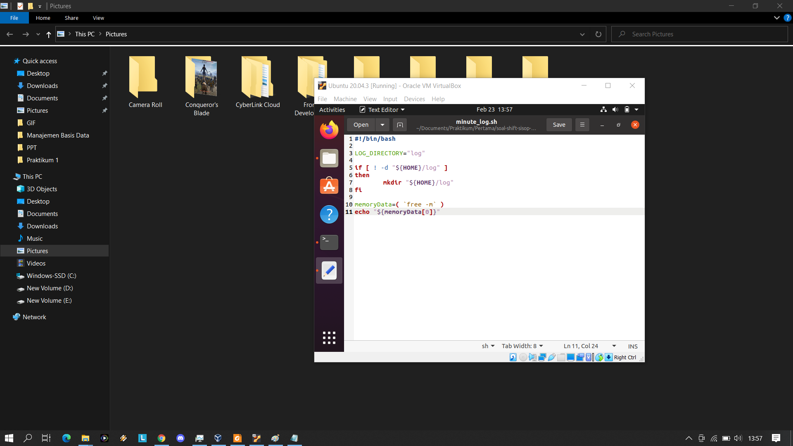
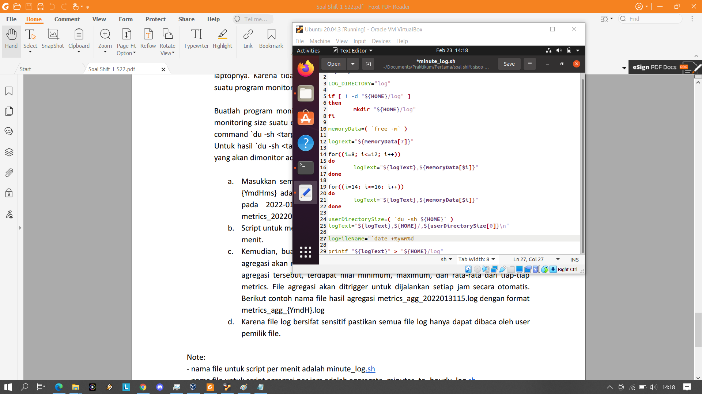
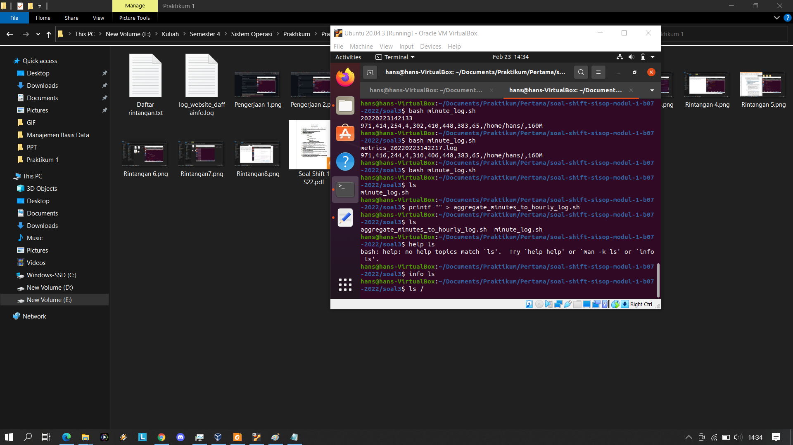
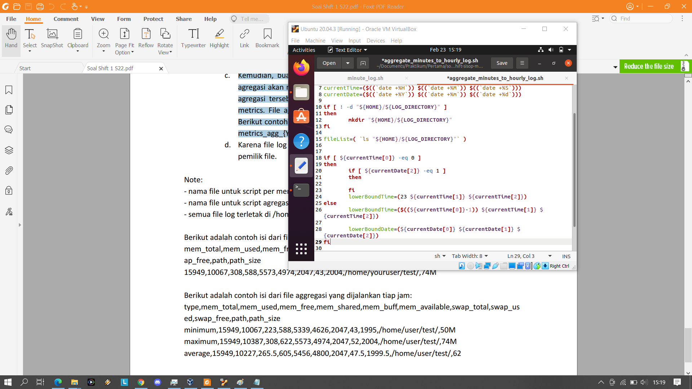
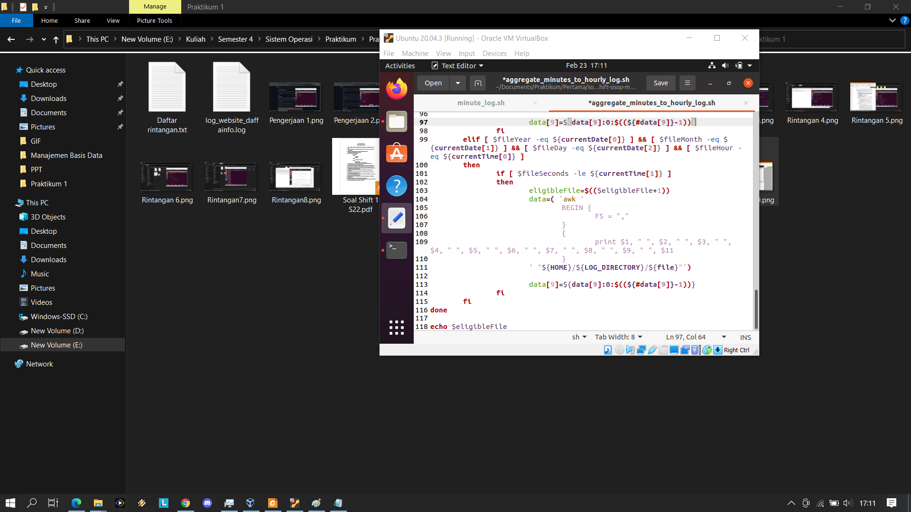
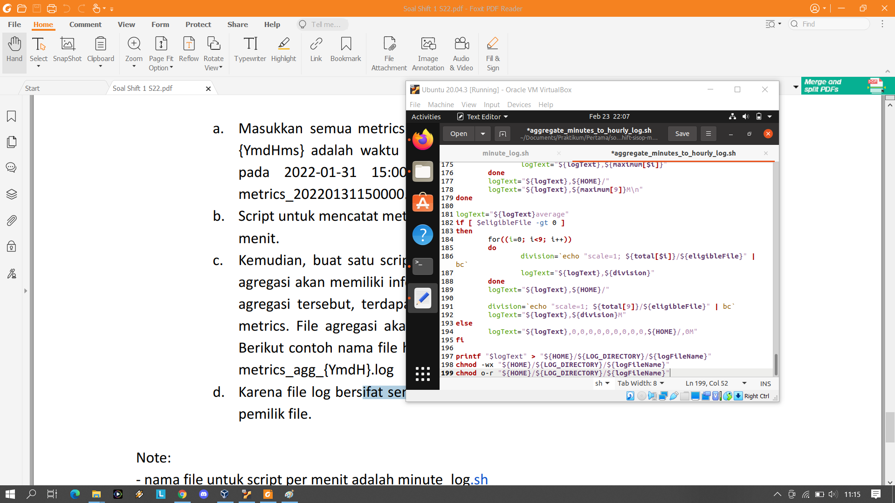
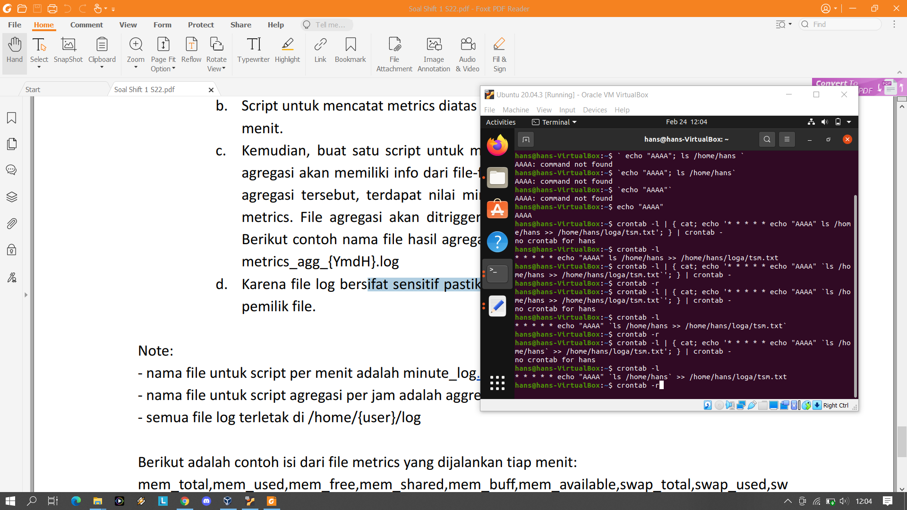
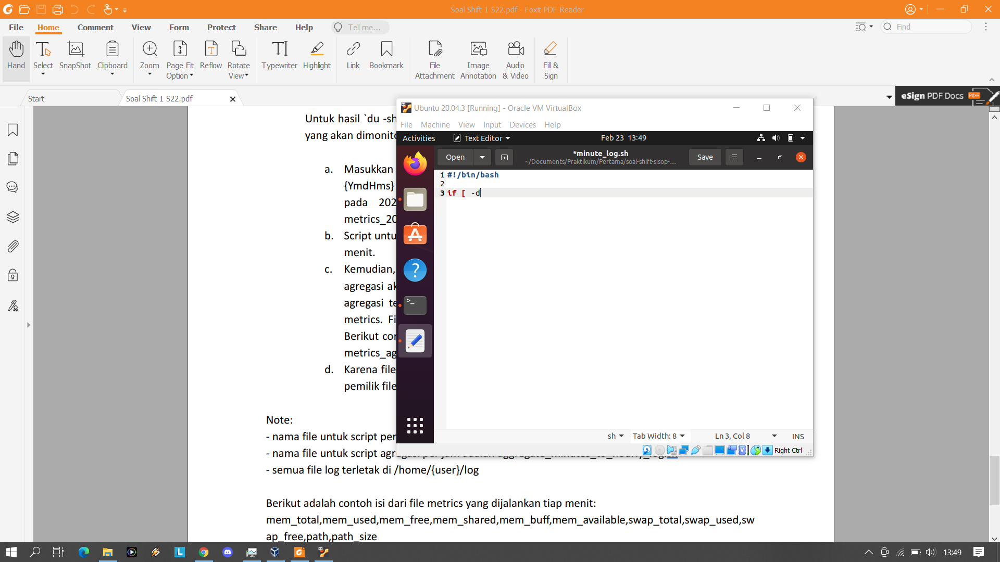
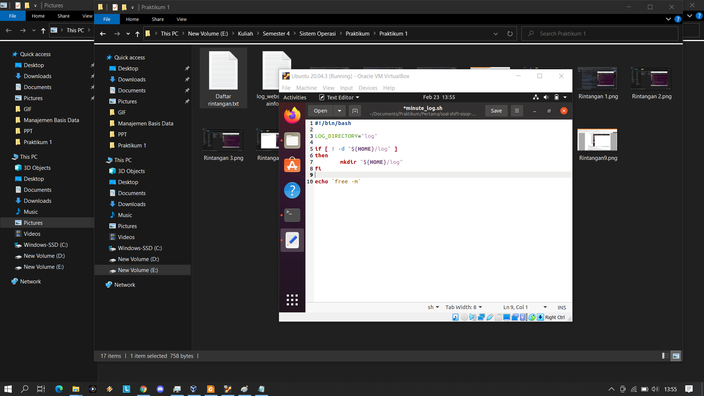

# Soal Shift Sisop Modul 1 2022

Repository untuk soal shift sisop modul 1 kelompok B07 tahun 2022

## Nomor 3

**minute_log.sh**

Script bash minute_log.sh akan dijalankan setiap menit untuk mencatat data memori dan kapasitas 
direktori /home/{user} di dalam file bernama metrics_{YmdHms}.log yang berada di direktori
home/{user}/log. YmdHMS adalah waktu ketika script dijalankan, Y adalah tahun (4 digit), 
m adalah bulan, d adalah tanggal, H adalah jam, M adalah menit, dan S adalah detik.
File log yang dihasilkan hanya boleh di read oleh user yang bersangkutan

Script di bawah menginisialisasi nama direktori tempat penyimpanan file log dan nama file log yang akan dihasilkan

```bash
LOG_DIRECTORY="log"
 
logFileName="metrics_`date +%Y%m%d%H%M%S`.log"
```

Bila direktori untuk menyimpan file log tidak ada, maka akan dibuat terlebih dahulu. 
Script di bawah akan mengecek apakah direktori tidak ada dan bila tidak ada, maka akan dibuat
direktori tersebut. ${HOME} adalah variabel yang menyimpan string "/home/{user}"

```bash
if [ ! -d "${HOME}/${LOG_DIRECTORY}" ]
then
	mkdir "${HOME}/${LOG_DIRECTORY}"
fi
```

Isi dari file log adalah data memori, teks /home/{user}/, dan kapasitas dari /home/{user}/.
Untuk mengambil data memori menggunakan command `free -m` yang kemudian dimasukkan ke dalam
array agar stringnya terpecah-pecah oleh " " (spasi). Data memori berada di index 7 hingga 12
dan data swap berada di index 14 hingga 16. Semua data tersebut disimpan ke dalam variabel
logText.

```bash
memoryData=( `free -m` )

logText="${memoryData[7]}"

for((i=8; i<=12; i++))
do
	logText="${logText},${memoryData[$i]}"
done

for((i=14; i<=16; i++))
do
	logText="${logText},${memoryData[$i]}"
done
```

Untuk mengambil data kapasitas dari /home/{user}/ menggunakan command `du -sh ${HOME}` dan teks
keluarannya disimpan ke dalam array untuk memecah hasilnya berdasarkan " " (spasi) karena
data yang dibutuhkan hanya substring pertama (index 0 pada array). Teks /home/{user}/ dan data kapasitas 
ditambahkan ke dalam variabel logText.

```bash
userDirectorySize=( `du -sh ${HOME}` )
logText="${logText},${HOME}/,${userDirectorySize[0]}\n"
```

String logText yang telah dibuat kemudian di simpan ke dalam file log, kemudian
permission file log tersebut hanya read only agar tidak terjadi perubahan isi file
dan untuk user lain tidak diperbolehkan membuka file log tersebut. `chmod -wx <file>`
untuk menghilangkan permission write dan execute untuk setiap kelompok user dan
`chmod o-r <file>` untuk menghilangkan permission read untuk kelompok other (user lain)

```bash
printf "${logText}" > "${HOME}/${LOG_DIRECTORY}/${logFileName}"
chmod -wx "${HOME}/${LOG_DIRECTORY}/${logFileName}"
chmod o-r "${HOME}/${LOG_DIRECTORY}/${logFileName}"
```

**aggregate_minutes_to_hourly_log.sh**

Script bash aggregate_minutes_to_hourly_log.sh akan dijalankan setiap jam untuk mendata log file
yang berasal diciptakan oleh minute_log.sh sejam sebelum script aggregate_minutes_to_hourly_log.sh ini dijalankan.
Untuk mendata file-file tersebut, maka harus menentukan dahulu file-file log yang memenuhi syarat dengan melihat
waktu pembuatan file log yang berada di nama file log tersebut, kemudian membaca satu-persatu file tersebut.

Script di bawah menginisialisasi variabel penting yaitu nama direktori
penyimpanan log, kemudian array monthDay berguna untuk mempermudah perhitungan mundur 1 jam
sebelumnya bila menyebabkan mundur bulan. Misalnya bila tanggal script ini dijalankan pada
tanggal 1 April jam 00:00:00, maka file yang perlu dicari adalah file yang dibuat pada tanggal
31 Maret jam 23:00:00 hingga 1 April jam 00:00:00. Karena jumlah hari setiap bulan berbeda,
maka akan lebih cepat melakukan perhitungan mundur tanggal dengan menyimpan jumlah hari setiap bulan.
Kemudian juga menginisialisasi nama file log yang akan dihasilkan

```bash
LOG_DIRECTORY="log"

monthDay=(0 31 28 31 30 31 30 31 31 30 31 30 31)

logFileName="metrics_agg_`date +%Y%m%d%H`.log"
```

Script di bawah untuk mendapatkan waktu ketika script dijalankan yang akan menjadi waktu
batas atas pencarian file yang diciptakan mulai dari sejam sebelum script ini dijalankan
hingga ketika script dijalankan. Untuk data menit dan detik digabungkan menjadi satu
dalam detik untuk mempermudah dilakukannya pengecekan dalam skala menit dan detik
dari suatu file.

```bash
currentTime=($((`date +%-H`)) $((`date +%-M` * 60 + `date +%-S`)))
currentDate=($((`date +%-Y`)) $((`date +%-m`)) $((`date +%-d`)))
```

Seperti minute_log.sh, bila folder direktori penyimpanan tidak ada, maka akan dibaut
terlebih dahulu.

```bash
if [ ! -d "${HOME}/${LOG_DIRECTORY}" ]
then
	mkdir "${HOME}/${LOG_DIRECTORY}"
fi
```

Nama seluruh file pada direktori log diambil menggunakan command `ls` yang nantinya setiap
file akan diperiksa namanya satu persatu

```bash
fileList=`ls "${HOME}/${LOG_DIRECTORY}"`
```

Script di bawah untuk menghitung batas bawah pencarian file. Bila script dijalankan pada pukul 01:00:00
ke atas, untuk mencari waktu dari batas bawah mudah dengan mengurangkan waktu sejam dari waktu
batas atas. Tetapi, bila dijalankan sebelum pukul 01:00:00, maka sejam sebelumnya akan mundur hari.
Ini akan menyebabkan banyak masalah bila terjadi pada tanggal 1 terutama pada tanggal 1 Maret dan 1 Januari.
Bila bukan pada tanggal 1, maka mundur hari hanya perlu mengurangi tanggal sebanyak 1 dan batas bawah jam
pada pukul 23, tetapi bila tanggal 1 maka akan menyebabkan perubahan bulan. Bila tanggal 1 Maret, mundur
bulan akan menjadi bulan Februari dan Februari memiliki sistem kabisat di mana Februari akan memiliki 29 
hari bila tahunnya adalah kelipatan 400 atau kelipatan 4 dan bukan kelipatan 100. Kemudian bila tanggal 1
Januari, maka akan menyebabkan pengurangan tahun sebanyak 1. Untuk pengurangan hari, batas bawah jam akan menjadi
pukul 23.

Array monthDay yang telah diinisialisasi di awal digunakan untuk mempermudah pengurangan yang terjadi 
pada pukul 0 tanggal 1. Karena bila pengurangan 1 jam terjadi pada waktu tersebut akan menyebabkan batas bawah
menjadi pukul 23 tanggal terakhir dari bulan sebelumnya. Untuk menit dan detik tidak mengalami perubahan karena
mundur 1 jam tidak menyebabkan perubahan menit dan detik.

```bash
if [ ${currentTime[0]} -eq 0 ]
then
	lowerBoundDate=(${currentDate[0]} ${currentDate[1]} ${currentDate[2]})
	lowerBoundTime=(23 ${currentTime[1]})
	
	if [ ${currentDate[2]} -eq 1 ]
	then
		if [ ${currentDate[1]} -eq 3 ]
		then
			${lowerBoundDate[1]}=2
			
			if [ $((${currentDate[0]} % 400)) -eq 0 ]
			then
				${lowerBoundDate[2]}=29
			elif [ $((${currentDate[0]} % 4)) -eq 0 ] && [ $((${currentDate[0]} % 100)) -ne 0 ]
			then
				${lowerBoundDate[2]}=29
			else
				${lowerBoundDate[2]}=28
			fi
		elif [ ${currentDate[1]} -eq 1 ]
		then
			${lowerBoundDate[2]}=31
			${lowerBoundDate[1]}=12
			${lowerBoundDate[0]}=$((${currentDate[0]}-1))
		else
			${lowerBoundDate[1]}=$((${currentDate[1]}-1))
			${lowerBoundDate[2]}=${monthDay[${lowerBoundDate[1]}]}
		fi
	else
		${lowerBoundDate[2]}=$((${lowerBoundDate[2]}-1))
	fi
else
	lowerBoundTime=($((${currentTime[0]}-1)) ${currentTime[1]})
	
	lowerBoundDate=(${currentDate[0]} ${currentDate[1]} ${currentDate[2]})
fi
```

Script di bawah untuk menginisialisasi variabel yang menyimpan nilai-nilai yang didapat
dari file-file yang akan dibaca dan menghitung jumlah file tersebut.

```bash
eligibleFile=0
total=(0 0 0 0 0 0 0 0 0 0)
minimum=(0 0 0 0 0 0 0 0 0 0)
maximum=(0 0 0 0 0 0 0 0 0 0)
```

Script di bawah akan mengecek nama satu-persatu file yang ada di direktori log apakah
merupakan file yang dibuat sejam sebelum script ini dijalankan. Untuk mengeceknya
dengan mengubah keterangan waktu yang terdapat di nama file menjadi integer
dan melakukan pengecekan apakah memenuhi syarat. Selain itu, perlu dilakukan pengecekan nama file
apakah sesuai dengan format nama file log yang dihasilkan oleh minute_log.sh agar tidak terjadi
kesalahan pengubahan nama file menjadi integer. Data tahun, bulan, hari, jam, dan detik didapatkan
dengan mengubah sebagian substring pada nama file. Untuk menit dan detik dijadikan satu dalam
detik agar mempermudah perbandingan dengan waktu batas bawah dan batas atas.

Setelah mendapatkan waktu pembautan file, waktunya akan dicek apakah berada pada range waktu batas bawah
dan batas atas. Karena selang waktu hanyalah sejam, maka pengecekan file hanya perlu mengecek apakah
tahun, bulan, hari, dan jam file tersebut dibuat sama dengan tahun, bulan, hari, dan jam batas atas atau batas bawah.
Bila sama dengan batas atas, maka detiknya akan dibandingkan, bila detiknya kurang atau sama dengan detik batas atas, 
maka file memenuhi syarat atau bila sama dengan batas bawah maka detiknya harus lebih besar atau sama 
dengan detik batas bawah. Misalnya, bila batas atas adalah 2022-02-23 10:00:00 dan batas bawah adalah
2022-02-23 09:00:00, file yang memenuhi syarat akan diciptakan pada 2022-02-23 dari pukul 09:00:00 hingga 10:00:00
artinya tinggal mengecek menit-detiknya, kalau batas atas harus lebih dari detik batas bawah, jadi hanya akan bisa
untuk yang dibuat pada pukul 09:00:00 hingga 09:59:59, kalau batas atas akan mengecek yang dibuat
pada pukul 10:00:00 hingga 10:00:00. Pengecekan sistem ini hanya dapat terjadi untuk jeda waktu 1 jam karena
bila jeda 2 jam misalnya batas atas pukul 10:30:00 dan batas bawah pukul 08:30:00, pengecekan sistem ini
hanya akan mengecek file yang dibuat pada pukul 08:30:00 hingga 08:59:59 dan 10:00:00 hingga 10:30:00
menyebabkan file yang dibuat pada pukul 09:00:00 hingga 09:59:59 yang seharusnya memenuhi syarat
menjadi tidak memenuhi syarat

Bila file memenuhi syarat, maka isinya akan dibaca menggunakan `awk` dan nilai-nilainya disimpan ke dalam
variabel penyimpanan yang telah dibuat.

```bash
for file in $fileList
do
	
	if [ ${#file} -eq 26 ] && [ ${file:0:8} == "metrics_" ] && [ ${file:0:12} != "metrics_agg_" ]
	then
		fileYear=$((10#${file:8:4}))
		fileMonth=$((10#${file:12:2}))
		fileDay=$((10#${file:14:2}))
		fileHour=$((10#${file:16:2}))
		fileSeconds=$((10#${file:18:2} * 60 + 10#${file:20:2}))
		
		if [ $fileYear -eq ${lowerBoundDate[0]} ] && [ $fileMonth -eq ${lowerBoundDate[1]} ] && [ $fileDay -eq ${lowerBoundDate[2]} ] && [ $fileHour -eq ${lowerBoundTime[0]} ]
		then
			if [ $fileSeconds -ge ${lowerBoundTime[1]} ]
			then
				eligibleFile=$(($eligibleFile+1))
				data=( `awk '
					BEGIN {
						FS = ","
					}
					{
						print $1, " ", $2, " ", $3, " ", $4, " ", $5, " ", $6, " ", $7, " ", $8, " ", $9, " ", $11
					}
				' "${HOME}/${LOG_DIRECTORY}/${file}"`)
				
				data[9]=${data[9]:0:$((${#data[9]}-1))}
				
				for((i=0; i<10; i++))
				do
					total[$i]=$((${total[$i]}+${data[$i]}))
					if [ $((${minimum[$i]})) -gt $((${data[$i]})) ] || [ $eligibleFile -eq 1 ]
					then
						minimum[$i]=$((${data[$i]}))
					elif [ $((${maximum[$i]})) -lt $((${data[$i]})) ] || [ $eligibleFile -eq 1 ]
					then
						maximum[$i]=$((${data[$i]}))
					fi
				done
			fi
		elif [ $fileYear -eq ${currentDate[0]} ] && [ $fileMonth -eq ${currentDate[1]} ] && [ $fileDay -eq ${currentDate[2]} ] && [ $fileHour -eq ${currentTime[0]} ]
		then
			if [ $fileSeconds -le ${currentTime[1]} ]
			then
				eligibleFile=$(($eligibleFile+1))
				data=( `awk '
					BEGIN {
						FS = ","
					}
					{
						print $1, " ", $2, " ", $3, " ", $4, " ", $5, " ", $6, " ", $7, " ", $8, " ", $9, " ", $11
					}
				' "${HOME}/${LOG_DIRECTORY}/${file}"`)
				
				data[9]=${data[9]:0:$((${#data[9]}-1))}
				
				for((i=0; i<10; i++))
				do
					total[$i]=$((${total[$i]}+${data[$i]}))
					if [ $((${minimum[$i]})) -gt $((${data[$i]})) ] || [ $eligibleFile -eq 1 ]
					then
						minimum[$i]=$((${data[$i]}))
					elif [ $((${maximum[$i]})) -lt $((${data[$i]})) ] || [ $eligibleFile -eq 1 ]
					then
						maximum[$i]=$((${data[$i]}))
					fi
				done
			fi
		fi
	fi
done
```

Script di bawah untuk membangun teks log yang akan disimpan di dalam log file beserta dengan
rata-rata data yang telah diciptakan. Karena di dalam contoh soal pada bagian rata-rata terdapat
nilai yang desimal, maka rata-rata yang dihasilkan juga memiliki desimal namun karena pembagian
pada script bash selalu berupa integer, echo "scale=1; <nilai 1>/<nilai 2>" | bc` yang menyebabkan
setiap nilai meskipun pembagiannya bernilai bulat akan memiliki .0 dibelakangnya 
(presisi hingga 1 nilai belakang koma). Berdasarkan contoh soal, nilai belakang koma menggunakan tanda
"." bukan "," sehingga perhitungan tidak menggunakan `awk` karena desimal `awk` menggunakan ",". 

```bash
logText="minimum"

for((i=0; i<10; i++))
do
	for((i=0; i<9; i++))
	do
		logText="${logText},${minimum[$i]}"
	done
	logText="${logText},${HOME}/"
	logText="${logText},${minimum[9]}M\n"
done

logText="${logText}maximum"

for((i=0; i<10; i++))
do
	for((i=0; i<9; i++))
	do
		logText="${logText},${maximum[$i]}"
	done
	logText="${logText},${HOME}/"
	logText="${logText},${maximum[9]}M\n"
done

logText="${logText}average"
if [ $eligibleFile -gt 0 ]
then
	for((i=0; i<9; i++))
	do
		division=`echo "scale=1; ${total[$i]}/${eligibleFile}" | bc`
		logText="${logText},${division}"
	done
	logText="${logText},${HOME}/"
	
	division=`echo "scale=1; ${total[9]}/${eligibleFile}" | bc`
	logText="${logText},${division}M"
else
	logText="${logText},0,0,0,0,0,0,0,0,0,${HOME}/,0M"
fi
```

Kemudian hasil log text disimpan ke dalam file log dan permissionnya
dibatasi hanya menjadi read only untuk semua user kecuali user lain (other)
yang permissionnya dibuat none sehingga sama sekali
tidak bisa membaca file atau mengganti file.

```bash
printf "$logText" > "${HOME}/${LOG_DIRECTORY}/${logFileName}"
chmod -wx "${HOME}/${LOG_DIRECTORY}/${logFileName}"
chmod o-r "${HOME}/${LOG_DIRECTORY}/${logFileName}"
```

## cron

Untuk menjalankan crontab yang diperlukan adalah
- * * * * * bash minute_log.sh 
- 0 * * * * bash aggregate_minutes_to_hourly_log.sh

* * * * * akan membuat script bash dijalankan setiap menitnya

0 * * * * akan membuat script bash dijalankan setiap menit 0 dalam arti lain setiap jam

Kami sudah mencoba membuat script bash untuk langsung membuat crontab ketika program dijalankan yaitu dengan
crontab menjalankan semua script yang terdapat di dalam file bash (bukan menjalankan bash, tetapi langsung
kumpulan script yang di dalam bash dituliskan di crontab) namun sayangnya tidak dapat dijalankan
karena command `logFileName="metrics_agg_`date +%Y%m%d%H`.log"` yang entah mengapa tidak dapat dijalankan
namun ketika scriptnya di-copy dan dijalankan langsung pada terminal dapat berjalan dengan baik.

## Dokumentasi Pengerjaan dan Rintangan

Berikut adalah beberapa screenshoot dokumentasi pengerjaan dan rintangan











Rintangan yang dihadapi adalah mencari direktori /home/{user}/ yang ternyata nilainya disimpan pada variabel
$HOME. Kemudian melakukan partisi string data memori yang berasal dari `free -m` yang dapat dilakukan dengan
memasukkannya ke dalam array sehingga dipecah-pecah oleh " " (spasi). Kemudian membuat nama file log
berdasarkan waktu menggunakan `date` karena syntaxnya cukup banyak dan membingunkan. Kemudian melakukan
pengecekan file yang memenuhi syarat waktu yang membingungkan karena mundur sejam sebelum script 
aggregate_minutes_to_hourly_log.sh bisa berbeda hari, bulan, hingga tahun dan adanya tahun kabisat.
Kemudian membatasi permission file yang dibuat, kami mengasumsikan file hanya dapat dibaca oleh user yang
bersangkutan dan tidak ada user yang dapat mengubah isinya (termasuk pembuatnya). Rintangan terakhir adalah
crontab (sudah dijelaskan di bagian cron).
